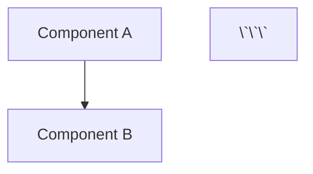

# How to Edit the Infrastructure Topology Diagrams

This guide explains how to edit each diagram format included in this repository.

## 📝 Quick Start Guide

### Option 1: Mermaid Diagram (Recommended for GitHub)
**File:** `infrastructure-topology-3.mmd`

#### Why Mermaid?
- ✅ Renders automatically in GitHub markdown
- ✅ Text-based - easy version control
- ✅ No additional software needed
- ✅ Can be embedded in documentation

#### How to Edit:
1. **In GitHub:**
   - Click on the `.mmd` file
   - Click the "Edit" button (pencil icon)
   - Make your changes
   - Preview renders automatically

2. **Using Mermaid Live Editor:**
   - Visit [https://mermaid.live/](https://mermaid.live/)
   - Copy the content from `infrastructure-topology-3.mmd`
   - Paste into the editor
   - Edit and see live preview
   - Copy back to file when done

3. **In VS Code:**
   - Install "Mermaid Preview" extension
   - Open the `.mmd` file
   - Press `Ctrl+Shift+P` → "Mermaid: Preview"
   - Edit with live preview

#### Example Edit:
```mermaid
%% To add a new component:
subgraph NewComponent["New Component (host.example.com)"]
    NC[New Component<br/>Description<br/>Port: 8080]
end

%% To add a connection:
AG -->|HTTPS 443| NC
```

---

### Option 2: PlantUML Diagram (Best for Documentation)
**File:** `infrastructure-topology-3.puml`

#### Why PlantUML?
- ✅ Industry standard for UML diagrams
- ✅ Text-based - version control friendly
- ✅ Extensive styling options
- ✅ Wide tool support

#### How to Edit:
1. **Using PlantUML Web Server:**
   - Visit [http://www.plantuml.com/plantuml/](http://www.plantuml.com/plantuml/)
   - Copy content from `infrastructure-topology-3.puml`
   - Paste into the text area
   - Click "Submit" to see diagram
   - Edit and resubmit

2. **In VS Code:**
   - Install "PlantUML" extension
   - Install Java (required for PlantUML)
   - Open the `.puml` file
   - Press `Alt+D` to preview
   - Edit with live preview

3. **Using IntelliJ IDEA:**
   - Install "PlantUML integration" plugin
   - Open the `.puml` file
   - Right-click → "Show PlantUML Diagram"
   - Edit with live preview

#### Example Edit:
```plantuml
' To add a new component:
package "New Component\nhost.example.com" as NewPkg #E1F5FF {
    component "New Component\nPort: 8080" as NewComp
}

' To add a connection:
Gateway -down-> NewComp : "HTTPS 443"
```

---

### Option 3: Draw.io Diagram (Best for Visual Editing)
**File:** `infrastructure-topology-3.drawio`

#### Why Draw.io?
- ✅ Visual drag-and-drop editor
- ✅ No coding required
- ✅ Export to PNG, PDF, SVG
- ✅ Professional-looking diagrams

#### How to Edit:
1. **Using Diagrams.net (Web):**
   - Visit [https://app.diagrams.net/](https://app.diagrams.net/)
   - Click "Open Existing Diagram"
   - Select `infrastructure-topology-3.drawio`
   - Edit using visual tools:
     - Drag to move components
     - Click to select and edit text
     - Use toolbar for shapes/connectors
     - Right-click for more options
   - File → Save As → Download

2. **In VS Code:**
   - Install "Draw.io Integration" extension
   - Open the `.drawio` file
   - Edit visually in VS Code
   - Changes save automatically

3. **Desktop App:**
   - Download [Draw.io Desktop](https://github.com/jgraph/drawio-desktop/releases)
   - Install and open the application
   - File → Open → Select `.drawio` file
   - Edit and save

#### Quick Tips:
- **Add Shape:** Drag from left sidebar
- **Connect:** Click on shape handle → drag to target
- **Style:** Right panel for colors/sizes
- **Align:** Select multiple → Right-click → Align
- **Export:** File → Export As → PNG/PDF/SVG

---

## 🎨 Customization Examples

### Adding a Load Balancer
All formats support adding new components. Here's the concept:

**Mermaid:**
```mermaid
subgraph LB["Load Balancer (lb.example.com)"]
    LoadBalancer[HAProxy<br/>Port: 443]
end
Users -->|HTTPS 443| LoadBalancer
LoadBalancer -->|HTTPS 443| AG
```

**PlantUML:**
```plantuml
package "Load Balancer\nlb.example.com" as LBPkg {
    component "HAProxy\nPort: 443" as LB
}
Users -> LB : "HTTPS 443"
LB -> Gateway : "HTTPS 443"
```

**Draw.io:**
1. Add rectangle from shape library
2. Label it "Load Balancer"
3. Draw connectors between Users, LB, and Gateway

### Changing Colors
**Mermaid:**
```mermaid
classDef newstyle fill:#ffcccc,stroke:#990000,stroke-width:3px
class NewComponent newstyle
```

**PlantUML:**
```plantuml
package "Component" as Pkg #FFCCCC {
    ...
}
```

**Draw.io:**
- Select shape → Style tab → Choose color

### Adding Notes/Annotations
**Mermaid:**
```mermaid
AG -.->|Note: This is important| AC
```

**PlantUML:**
```plantuml
note right of Gateway
  Important information
  about this component
end note
```

**Draw.io:**
- Insert → Shape → Basic → Text box

---

## 🔄 Converting Between Formats

### From Mermaid to PNG:
1. Use [Mermaid Live Editor](https://mermaid.live/)
2. Paste diagram code
3. Click "Actions" → "Download PNG"

### From PlantUML to PNG:
1. Use VS Code with PlantUML extension
2. Open `.puml` file
3. Right-click → "Export Current Diagram"

### From Draw.io to Other Formats:
1. Open in diagrams.net
2. File → Export As → Choose format (PNG, PDF, SVG, XML)

---

## 📊 Embedding in Documentation

### GitHub Markdown (Mermaid):
```markdown


### Confluence (PlantUML):
Use PlantUML macro or upload PNG export

### Wiki (Image):
Export Draw.io as PNG/SVG and embed

---

## 🛠️ Troubleshooting

### Mermaid Issues:
- **Diagram not rendering:** Check syntax with [Mermaid Live](https://mermaid.live/)
- **Box overlap:** Adjust using `graph TB` (top-bottom) vs `graph LR` (left-right)

### PlantUML Issues:
- **Java error:** Install Java JDK 11 or higher
- **Rendering slow:** Use web server instead of local rendering

### Draw.io Issues:
- **File won't open:** Ensure it's the `.drawio` or `.xml` extension
- **Lost changes:** Use File → Save regularly

---

## 📚 Additional Resources

### Mermaid:
- [Official Documentation](https://mermaid.js.org/)
- [Mermaid Live Editor](https://mermaid.live/)
- [Syntax Reference](https://mermaid.js.org/intro/syntax-reference.html)

### PlantUML:
- [Official Website](https://plantuml.com/)
- [Language Reference](https://plantuml.com/guide)
- [Component Diagrams](https://plantuml.com/component-diagram)

### Draw.io:
- [Diagrams.net](https://app.diagrams.net/)
- [User Manual](https://www.diagrams.net/doc/)
- [Keyboard Shortcuts](https://www.diagrams.net/doc/faq/shortcuts)

---

## ✅ Best Practices

1. **Version Control:**
   - Always commit diagram source files (.mmd, .puml, .drawio)
   - Add descriptive commit messages
   - Review changes in pull requests

2. **Documentation:**
   - Keep diagrams in sync with architecture
   - Update diagrams when components change
   - Include version/date in diagram title

3. **Collaboration:**
   - Use text formats (Mermaid/PlantUML) for easier code reviews
   - Export to PNG/PDF for presentations
   - Store both source and exported versions

4. **Naming Convention:**
   - Use descriptive file names
   - Include version or topology number
   - Group related diagrams in folders

---

**Need Help?** Open an issue in the repository or refer to the official documentation for each tool.
